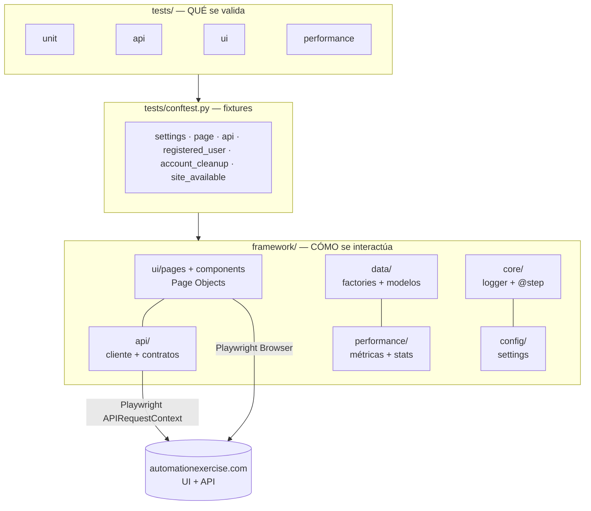
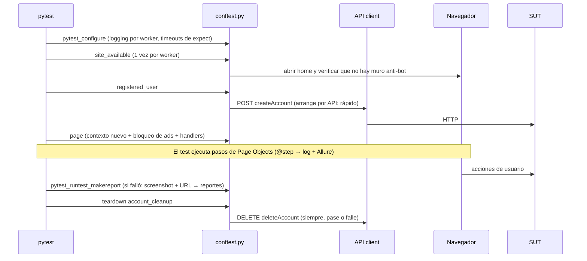

# Arquitectura

Este documento explica **cómo está organizado** el framework y **por qué** se tomó cada decisión.
Para instrucciones de uso, ver el [README](../README.md).

## 1. Vista de capas

**Regla de dependencias:** las flechas van solo hacia abajo. Un test nunca contiene un selector CSS
ni una URL de endpoint; un Page Object nunca contiene una aserción de negocio específica de un test.

| Capa | Responsabilidad | NO debe |
|---|---|---|
| `tests/` | Expresar el escenario y las aserciones (Arrange-Act-Assert) | Conocer selectores, URLs o detalles HTTP |
| `conftest.py` | Preparar y limpiar precondiciones (setup/teardown) | Contener lógica de negocio del escenario |
| `framework/ui` | Encapsular cómo se interactúa con cada pantalla | Decidir si un test pasa o falla (salvo verificar que la página cargó) |
| `framework/api` | Encapsular endpoints, reintentos y contratos | Lanzar excepciones por status HTTP (lo decide el test) |
| `framework/data` | Generar datos válidos, únicos e inmutables | Acceder a red o navegador |
| `framework/core` | Logging y trazabilidad transversal | Depender de las capas superiores |

## 2. Flujo de una ejecución

## 3. Decisiones de diseño

Cada decisión incluye la alternativa descartada, para que puedas evaluar si aplica a tu contexto.

### 3.1 Playwright también como cliente HTTP
- **Elegido:** `APIRequestContext` de Playwright.
- **Alternativa:** `requests`/`httpx`.
- **Por qué:** una sola dependencia, mismos timeouts y proxies, e integración nativa con el
  navegador (se podrían compartir cookies entre API y UI). La contra es que la API de `requests`
  es más conocida; por eso el cliente queda encapsulado en `BaseApiClient` y cambiarlo afecta un archivo.

### 3.2 El cliente API no lanza excepciones por status
- Los tests negativos necesitan inspeccionar respuestas 4xx. `ApiResponse` expone `http_status`
  **y** `response_code` (el código de negocio del body), porque este SUT responde siempre HTTP 200.
- Solo se lanza `ApiRequestError` cuando no hubo respuesta alguna (red caída tras los reintentos).

### 3.3 Reintentos solo en operaciones seguras
- Errores de red y HTTP 429/5xx se reintentan con backoff exponencial **solo en GET/PUT/DELETE**.
- `POST createAccount` nunca se reintenta: un reintento tras un timeout podría crear la cuenta dos veces
  y hacer fallar el test con "Email already exists" por una causa ajena al producto.
- Las búsquedas (POST de solo lectura) sí se reintentan, marcándolo explícitamente con `retry=True`.

### 3.4 Contratos estrictos (`extra="forbid"`)
- Si el backend agrega o renombra un campo, el test de contrato falla con el detalle exacto.
- Es intencional: el propósito de un contract test es enterarse **antes** que los consumidores.

### 3.5 Page Object Model + componentes
- Lo común a todas las pantallas (header, footer de suscripción, modales) es un **componente**
  que se compone dentro de las páginas, en vez de herencia profunda o código duplicado.
- Cada página declara `URL_PATTERN` y `loaded_indicator`: `open()` y las transiciones verifican que
  se llegó a la página correcta **antes** de interactuar (falla temprano y con mensaje claro).
- Los métodos devuelven la página destino cuando es determinística (`SignupPage.submit()` →
  `AccountCreatedPage`). Si depende del resultado (login válido/inválido), no devuelven nada.

### 3.6 Estrategia de locators (en orden de preferencia)
1. `get_by_role(...)` — refleja cómo el usuario (y los lectores de pantalla) perciben la UI.
2. `data-qa` — atributos dedicados a testing; estables ante cambios visuales.
3. IDs / CSS semánticos acotados a un contenedor (`#cart_info_table tbody tr[id^='product-']`).
4. Nunca: XPath absolutos, índices posicionales (`nth(3)`) para identificar datos, textos de estilo.

Para identificar productos se usa su **id** (`a[href='/product_details/5']`), no su posición en la grilla.

### 3.7 Cero esperas fijas
- Ningún `time.sleep` ni `wait_for_timeout` en el código de UI.
- Playwright espera a que los elementos sean accionables; `expect` reintenta hasta el timeout.
- Donde hay animaciones (modal del carrito), se espera la **condición** (`to_be_hidden()`), no un tiempo.

### 3.8 Arrange por API, Act/Assert por UI
- `registered_user` crea la cuenta vía API (~10x más rápido que el formulario).
- Así el test de login no falla si se rompe el registro: cada test falla por **una** razón.
- La API también actúa como **oráculo**: la UI debe mostrar exactamente lo que la API devuelve.

### 3.9 Aislamiento total entre tests
- Cada test recibe un **contexto de navegador nuevo** (cookies, storage y carrito vacíos).
- Cada test genera **datos únicos** (UUID en el email): pueden correr en cualquier orden y en paralelo.
- `account_cleanup` elimina las cuentas en el teardown aunque el test falle. La limpieza es
  *best-effort*: nunca hace fallar un test que pasó.

### 3.10 Ruido externo neutralizado en la red
- La publicidad se bloquea con `context.route` (antes de que llegue al navegador) en vez de cerrar
  popups reactivamente: más rápido, determinístico e independiente del DOM de los anuncios.
- Overlays impredecibles (banner de consentimiento) se manejan con `page.add_locator_handler`,
  que solo actúa si el overlay aparece y bloquea una acción.

### 3.11 Detección (no evasión) de protecciones anti-bot
- `site_available` verifica una vez por worker que el sitio responde contenido real.
- Si hay un muro anti-bot, los tests terminan en **ERROR de setup** con un mensaje accionable, en vez
  de 60 timeouts crípticos. El framework **no** intenta evadir la protección.

### 3.12 Logging y trazabilidad
- `@step("...")` en los Page Objects produce, con una sola línea, un log de texto y un paso de Allure.
- Argumentos sensibles (`password`, `card`, `cvc`...) se enmascaran automáticamente en logs y reportes;
  `User` y `PaymentCard` tampoco exponen secretos en su `repr`.
- Un archivo de log por worker de xdist (`logs/test_run_gw0.log`) evita líneas intercaladas.

### 3.13 Configuración tipada
- `pydantic-settings` valida tipos y rangos al arrancar. Precedencia: entorno > `.env` > defaults.
- `api_base_url` fuerza la barra final: sin ella, `"api" + "productsList"` se resolvería (RFC 3986) como
  `/productsList`. Es un bug clásico y silencioso que queda prevenido por diseño.

## 4. Puntos de extensión

| Quiero... | Dónde |
|---|---|
| Apuntar a otro entorno | `QA_BASE_URL` / `QA_API_BASE_URL` o `--base-url` |
| Agregar una pantalla | `framework/ui/pages/` (ver [WRITING_TESTS.md](WRITING_TESTS.md)) |
| Agregar un endpoint | `framework/api/automation_exercise_api.py` + esquema en `schemas.py` |
| Agregar un tipo de dato | `framework/data/models.py` + factory en `factories.py` |
| Cambiar el reporte | Hooks en `tests/conftest.py` (`pytest_runtest_makereport`) |
| Bloquear otro dominio | `AD_DOMAINS_PATTERN` en `framework/ui/browser_setup.py` (+ test unitario) |
